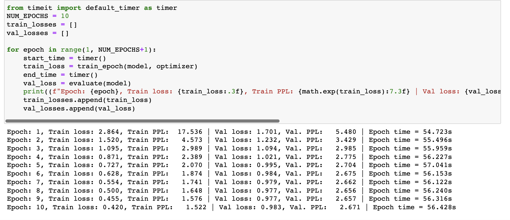
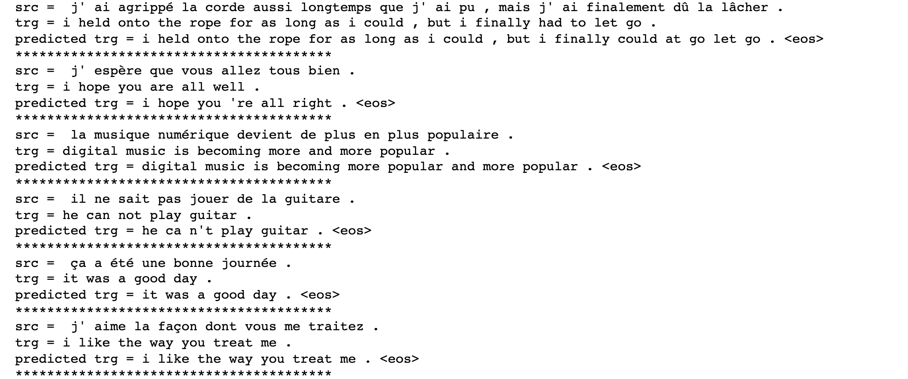
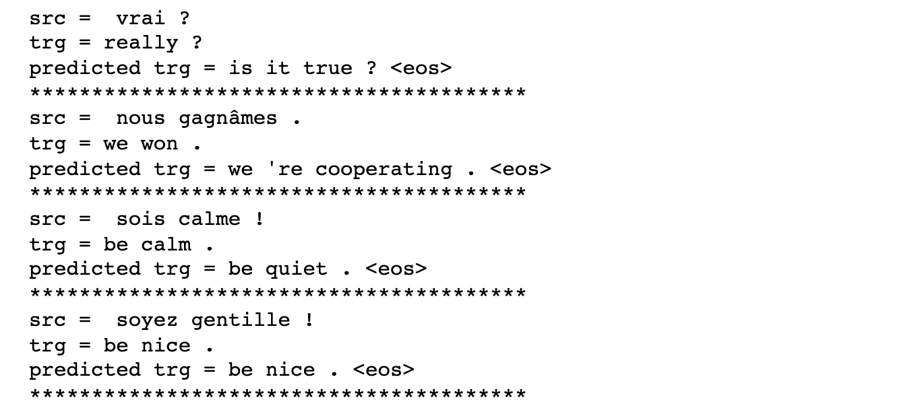

# Problem Statement
Train the Transformer code on a dataset other than Multi30k

## Dataset used
we have used the data set from the attention module which is about translating French statements to English Statements.

There are 135842 french-english pairs in the original dataset.

We have divided into training and testing data with 0.75 ratio
So the model is trained with 101882 pairs

## Training Logs

## Results

The model is doing well on long sentences

While on short sentences there are some misses

## Contributors
1. Rohit Agarwal
2. Kushal Gandhi
3. Vivek Kumar
4. Ammishaddai U